<div align="center">

# 🛒 QuickCart Delivery Analytics

### End-to-End Data Pipeline & Business Intelligence for a Multi-City Food Delivery Platform


*A complete data analytics case study built on 150,000 delivery orders across 5 global cities — covering ETL, exploratory data analysis, statistical correlation, and executive reporting.*

</div>

---

## 📑 Table of Contents

1. [Project Overview](#-project-overview)
2. [Tech Stack](#-tech-stack)
3. [Repository Structure](#-repository-structure)
4. [Dataset](#-dataset)
5. [AWS Infrastructure](#-aws-infrastructure)
6. [ETL Pipeline](#-etl-pipeline)
7. [ETL Logger](#-etl-logger)
8. [Executive KPI Summary](#-executive-kpi-summary)
9. [Visual Analytics](#-visual-analytics)
   - [Revenue Analysis](#-revenue-analysis)
   - [Delivery Performance](#-delivery-performance)
   - [Customer Behaviour](#-customer-behaviour)
   - [Risk & Correlation Analysis](#-risk--correlation-analysis)
10. [Key Insights](#-key-insights)
11. [Getting Started](#-getting-started)
12. [License](#-license)

---

## 🧭 Project Overview

**QuickCart Delivery Analytics** simulates a real-world data analyst workflow for an online food delivery marketplace operating across **Singapore, London, New York, Mumbai, and Sydney**. The project ingests raw order-level data, moves it through a Python-based ETL pipeline into a MySQL data warehouse hosted on AWS RDS, and produces a full suite of exploratory visualizations and an executive-ready KPI report.

The goal is to answer the kinds of questions a delivery platform's operations and growth teams actually ask:

- Which cities and restaurant categories drive the most revenue?
- How do traffic and weather conditions affect delivery time?
- What does the relationship between delivery distance and delivery time look like?
- Which customers are most likely to churn, and why?
- Is there a link between order value, ratings, and complaints?

---

## 🛠 Tech Stack

| Layer | Tools |
|---|---|
| **Ingestion** | AWS S3 (raw data lake), `boto3` |
| **Transformation** | Python, Pandas, NumPy |
| **Warehouse** | MySQL on AWS RDS, `SQLAlchemy` |
| **Analysis** | Pandas, NumPy, statistical correlation |
| **Visualization** | Matplotlib, Seaborn |
| **BI / Dashboards** | Tableau |
| **Logging** | Python `logging` module |
| **Environment** | `venv`, `.env` config |

---

## 🗂 Repository Structure

```
QuickCart-Delivery-Analytics/
│
├── data/
│   ├── raw/                    # Original extracted data (150,000 rows)
│   └── processed/              # Cleaned & transformed data
│
├── python/
│   ├── etl/
│   │   ├── extract.py          # Pulls raw data from S3
│   │   ├── transform.py        # Cleans & reshapes the dataset
│   │   ├── load.py             # Loads data into MySQL RDS
│   │   ├── pipeline.py         # Orchestrates the ETL run
│   │   └── logger.py           # Centralized logging config
│   │
│   ├── eda.py                  # Core exploratory data analysis
│   ├── data.py                 # Data assessment / profiling
│   ├── vis.py                  # Shared visualization helpers
│   ├── monthly_revenue.py
│   ├── customer_revenue.py
│   ├── restaurant_ratings.py
│   ├── traffic_delivery.py
│   ├── weather_delivery.py
│   ├── distance_vs_delivery.py
│   ├── customer_age_order_value.py
│   ├── order_value_vs_rating.py
│   ├── complaint_rate_city.py
│   ├── demand_score_distribution.py
│   └── correlation_heatmap.py
│
├── sql/                        # Warehouse queries
├── aws/                        # AWS configuration & IaC notes
├── tableau/                    # Tableau workbooks
├── reports/                    # Generated CSV & Markdown reports
├── screenshots/                # Chart exports referenced in this README
├── docs/                       # Additional documentation
├── etl.log                     # Latest pipeline run log
└── README.md
```

---

## 📊 Dataset

The pipeline processes **150,000 order records** across **21 columns**, with **zero missing values** and **zero duplicate rows** — a clean, analysis-ready dataset.

| Field | Description |
|---|---|
| `Order_ID` | Unique identifier per order |
| `Customer_Age`, `Customer_Type` | Demographics (New / Returning / Premium) |
| `Restaurant_Type`, `Cuisine_Type` | Merchant category |
| `Delivery_Distance_KM`, `Delivery_Time_Min` | Logistics metrics |
| `Order_Value_USD`, `Item_Count` | Transaction size |
| `Weather_Condition`, `Traffic_Level` | External delivery conditions |
| `Customer_Rating`, `Complaint_Flag`, `Refund_Flag` | Satisfaction signals |
| `Revenue_USD`, `Profit_USD` | Financial outcome |
| `City`, `Month`, `Quarter` | Dimensions for slicing |
| `Demand_Score`, `Churn_Risk` | Derived business scores |

**Distribution highlights:**

| Dimension | Breakdown |
|---|---|
| **Customer Type** | New: 50,185 · Returning: 49,912 · Premium: 49,903 |
| **Restaurant Type** | Cafe: 37,743 · Fast Food: 37,528 · Cloud Kitchen: 37,387 · Restaurant: 37,342 |
| **City** | Singapore: 30,236 · New York: 30,108 · London: 29,939 · Mumbai: 29,923 · Sydney: 29,794 |
| **Weather** | Sunny: 37,610 · Cloudy: 37,497 · Stormy: 37,447 · Rainy: 37,446 |
| **Traffic** | Low: 50,105 · Medium: 49,997 · High: 49,898 |

---

## ☁️ AWS Infrastructure

The pipeline runs on two managed AWS services in the **`ap-south-1` (Mumbai)** region: an S3 bucket as the raw data lake, and an RDS MySQL instance as the analytical warehouse.

<table>
<tr>
<td width="50%">

**Amazon S3 — Raw Data Lake**
Incoming order data lands in the `quickcart-food-delivery-kush1250` bucket as a flat CSV (`del.csv`, ~16.3 MB). This is the single source of truth that `extract.py` reads from at the start of every pipeline run.


</td>
<td width="50%">

**Amazon RDS — MySQL Warehouse**
The transformed data is loaded into `quickcart-db2`, a MySQL instance running on a `db.t4g.micro` node. This is the `delivery_data` table that `load.py` writes into, and the same instance the executive reports and Tableau dashboards query from.


</td>
</tr>
</table>

**Why this setup:**
- **S3** decouples ingestion from processing — new data can be dropped into the bucket at any time without touching the pipeline code.
- **RDS (MySQL)** gives the analytics scripts and Tableau a stable, queryable warehouse instead of re-reading a flat file on every run.
- **`db.t4g.micro`** keeps this a low-cost setup appropriate for a portfolio-scale dataset (150K rows); a production version would size up and add a read replica.

---

## 🔄 ETL Pipeline

The `python/etl/` package runs a fully logged, three-stage pipeline: **Extract → Transform → Load**, orchestrated by `pipeline.py`.

```
┌─────────────┐     ┌──────────────┐     ┌─────────────┐
│  1. EXTRACT  │ ──▶ │ 2. TRANSFORM │ ──▶ │  3. LOAD    │
│ extract.py   │     │ transform.py │     │  load.py    │
└─────────────┘     └──────────────┘     └─────────────┘
      │                     │                    │
      ▼                     ▼                    ▼
  Pull the CSV        Clean, type-cast,     Write the final
  from the S3          and reshape with      table into
  bucket via            Pandas               MySQL on RDS
  boto3                                       via SQLAlchemy
```

**What each stage does:**

| Stage | File | Responsibility |
|---|---|---|
| **Extract** | `extract.py` | Connects to S3 with `boto3`, locates the source CSV, and reads it into memory. |
| **Transform** | `transform.py` | Validates row counts, fixes data types, and reshapes columns into the warehouse schema. |
| **Load** | `load.py` | Opens a `SQLAlchemy` engine against the RDS MySQL endpoint and bulk-writes the cleaned data into the `delivery_data` table. |
| **Orchestration** | `pipeline.py` | Runs the three stages in sequence, timing the run and stopping on the first failure. |

> ⏱ **Full pipeline runtime: ~24.6 seconds** for 150,000 rows, extract to load.

> 🔐 **Security note:** credentials are read from a local AWS credentials file / `.env` and are **never committed to source control**. If you fork this project, populate your own `python/e.env` and AWS credentials locally — don't reuse or share the ones from this repo's history.

---

## 🪵 ETL Logger

Every pipeline run is logged end-to-end by `logger.py`, which configures a single shared Python `logging` instance used by `extract.py`, `transform.py`, and `load.py`. Each stage logs its own start, result, and row counts, so a full run is traceable from one log file without needing to add print statements.

**Actual run log** (`etl.log`, redacted of host/IP for this README):

```
2026-08-05 18:36:17,246 | INFO | ========== ETL Pipeline Started ==========
2026-08-05 18:36:17,246 | INFO | Starting data extraction from S3
2026-08-05 18:36:17,255 | INFO | Found credentials in shared credentials file: ~/.aws/credentials
2026-08-05 18:36:18,695 | INFO | Successfully extracted 150000 rows from S3
2026-08-05 18:36:18,696 | INFO | Starting data transformation
2026-08-05 18:36:18,754 | INFO | Transformation completed. Rows before: 150000, Rows after: 150000
2026-08-05 18:36:18,754 | INFO | Connecting to MySQL RDS
2026-08-05 18:36:41,845 | INFO | Successfully loaded 150000 rows into delivery_data
2026-08-05 18:36:41,846 | INFO | ETL Pipeline completed successfully
2026-08-05 18:36:41,846 | INFO | Pipeline execution time: 24.6 seconds
2026-08-05 18:36:41,846 | INFO | ========== ETL Pipeline Finished ==========
```

**Reading the log, stage by stage:**

1. **Pipeline start** — a clear `====` banner marks the beginning of the run, making individual runs easy to spot when scrolling through history.
2. **Extraction** — confirms AWS credentials were found locally, then confirms the exact row count pulled from S3 (150,000 rows), so a silent partial read would be immediately visible.
3. **Transformation** — logs row counts **before and after** cleaning (150,000 → 150,000 here), which is the quickest way to catch accidental row drops during transformation.
4. **Load** — logs the RDS connection step, then confirms the exact number of rows written into `delivery_data`.
5. **Completion** — logs total pipeline execution time (24.6 seconds) and a closing banner, giving a simple performance benchmark for every run.

> 🔐 The real `etl.log` includes the RDS host address on the "Connecting to MySQL RDS" line — that's been removed here since a database endpoint is infrastructure detail that shouldn't be published in a public README.

---

## 📈 Executive KPI Summary

| KPI | Value |
|---|---:|
| **Total Orders** | 150,000 |
| **Total Revenue** | $37,843,112.84 |
| **Total Profit** | $13,504,910.56 |
| **Average Order Value** | $152.89 |
| **Average Delivery Time** | 64.53 minutes |
| **Average Customer Rating** | 3.00 / 5 |
| **Complaint Rate** | 10.07% |
| **Refund Rate** | 4.87% |

---

## 🖼 Visual Analytics

All charts below are generated directly by the scripts in `/python` and exported to `/screenshots`.

### 💰 Revenue Analysis

<table>
<tr>
<td width="50%">

**Revenue by City**
Singapore leads narrowly at **$7.63M**, with London, New York, and Mumbai clustered tightly behind ($7.56–7.59M) and Sydney slightly lower at $7.47M — revenue is remarkably evenly distributed across all five markets.

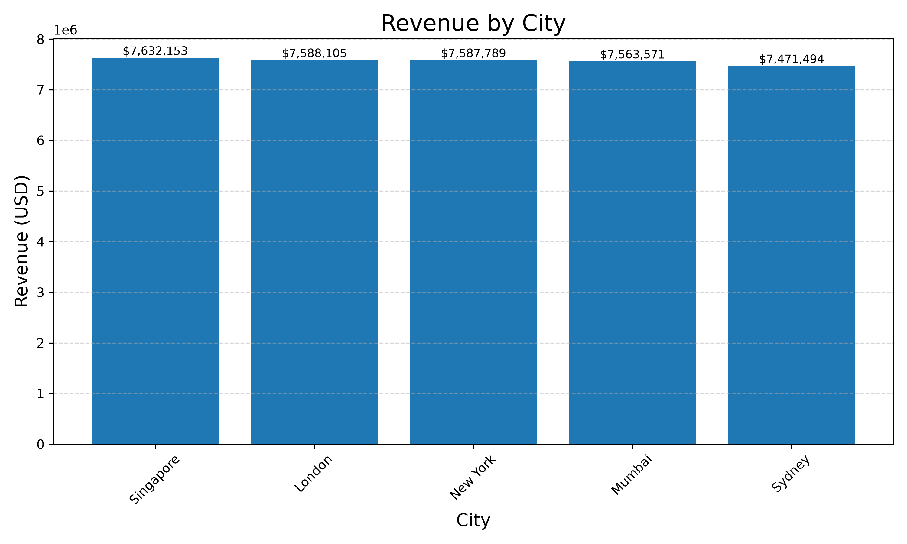

</td>
<td width="50%">

**Revenue by Restaurant Type**
Fast Food ($9.51M), Cafe ($9.48M), Restaurant ($9.47M), and Cloud Kitchen ($9.38M) all contribute almost identically to total revenue — no single category dominates the platform.

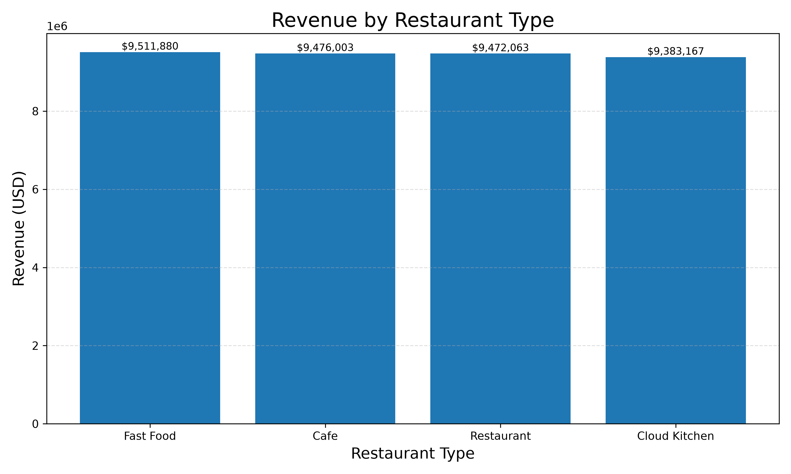

</td>
</tr>
<tr>
<td width="50%">

**Revenue by Customer Type**
New customers ($12.70M) edge out Premium ($12.58M) and Returning ($12.57M) — acquisition is currently outperforming retention in raw revenue terms.

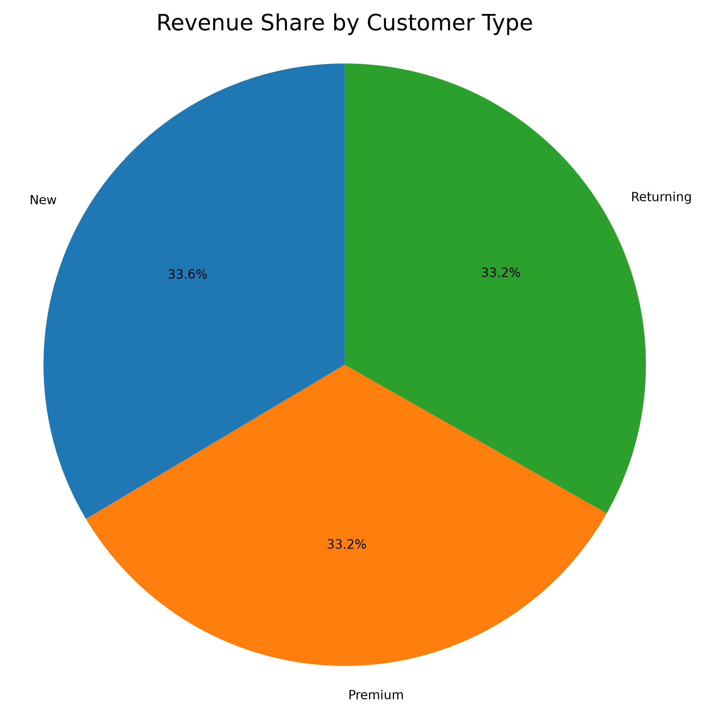

</td>
<td width="50%">

**Monthly Revenue Trend**
Revenue holds a stable band of **$2.94M–$3.24M** every month, with no strong seasonality — May and August are the strongest months.

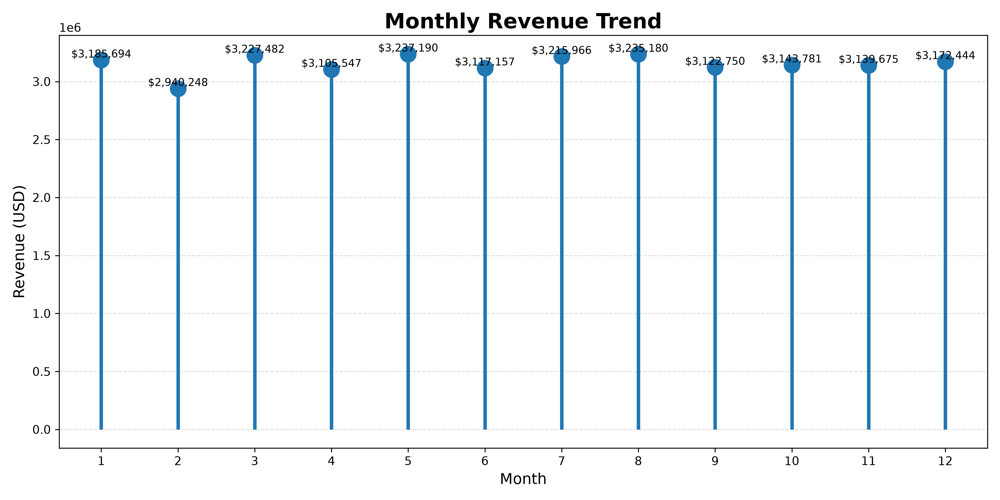

</td>
</tr>
</table>

---

### 🚚 Delivery Performance

<table>
<tr>
<td width="50%">

**Delivery Time by Traffic Level**
Average delivery time barely shifts with traffic — Medium (64.49 min), Low (64.54 min), and High (64.55 min) are nearly identical, suggesting traffic level isn't a major driver of delay in this dataset.

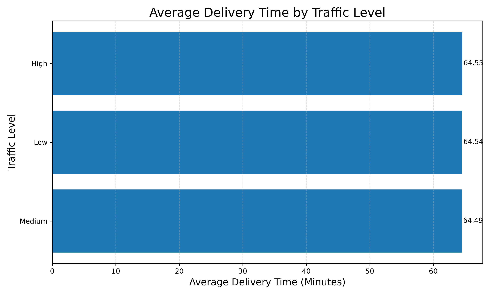

</td>
<td width="50%">

**Delivery Time by Weather**
Weather shows the same flat pattern — Sunny (64.45 min) through Stormy (64.60 min) — less than a minute of spread across all conditions.

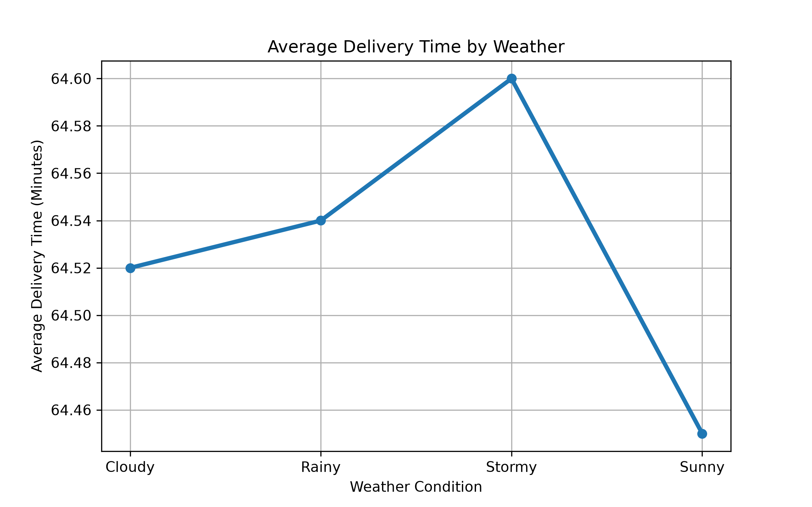

</td>
</tr>
<tr>
<td width="50%">

**Distance vs. Delivery Time**
Delivery distance ranges from 0.5 km to 25 km with a mean of 12.76 km, but correlates almost not at all with delivery time (**r ≈ 0.00**) — time is being driven by other operational factors, not raw distance.

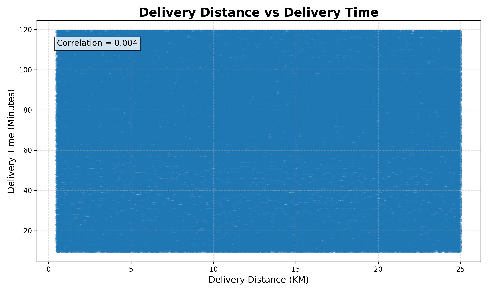

</td>
<td width="50%">

**Delivery Distance Distribution (Hexbin)**
A density view of distance vs. time confirms orders are spread evenly across the full range, with no visible clustering pattern.

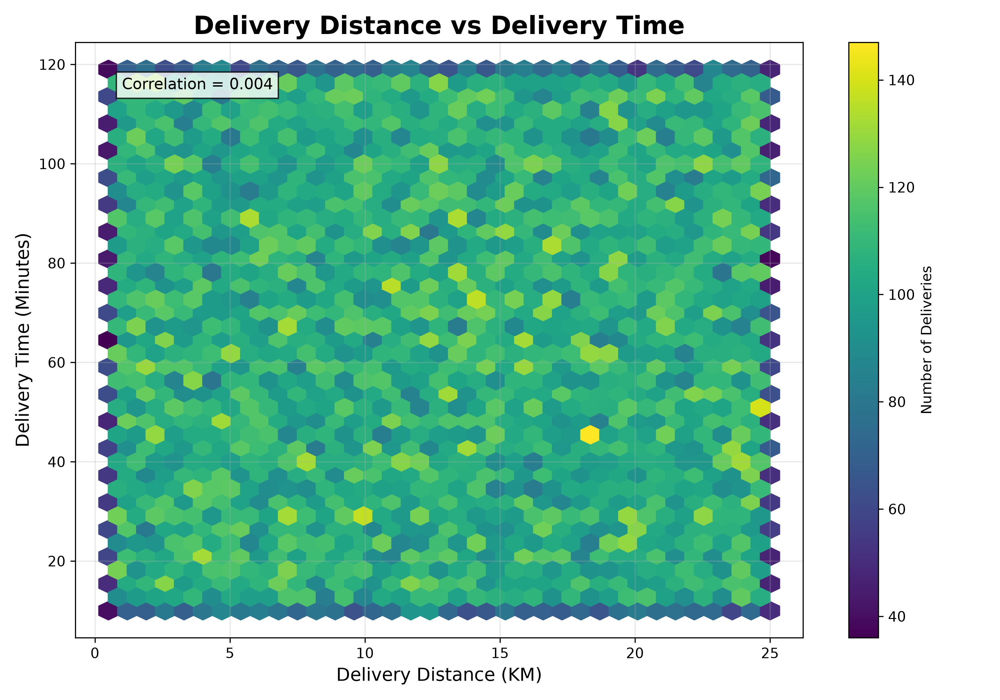

</td>
</tr>
</table>

---

### 🙋 Customer Behaviour

<table>
<tr>
<td width="50%">

**Customer Age vs. Order Value**
Order value shows no meaningful trend across the 18–74 customer age range — spending is consistent regardless of age.

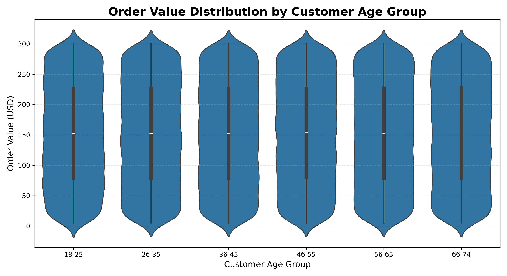

</td>
<td width="50%">

**Restaurant Ratings Distribution**
Ratings are near-uniformly distributed between 1 and 5 (average **3.00**), which suggests either a very balanced merchant pool or synthetic/rounded rating behaviour worth validating.

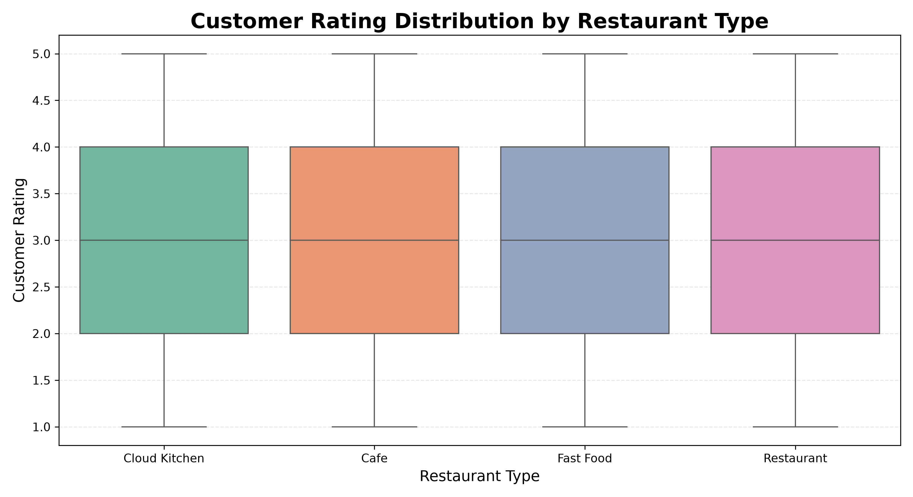

</td>
</tr>
<tr>
<td width="50%">

**Order Value vs. Customer Rating**
No strong relationship between how much a customer spends and the rating they leave — high-value orders aren't systematically rated higher or lower.

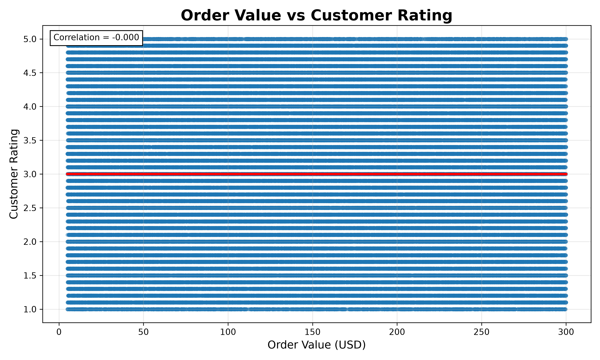

</td>
<td width="50%">

**Demand Score Distribution**
Demand scores are evenly spread from 0–100 (mean ≈ 50), indicating balanced demand intensity across the order base.

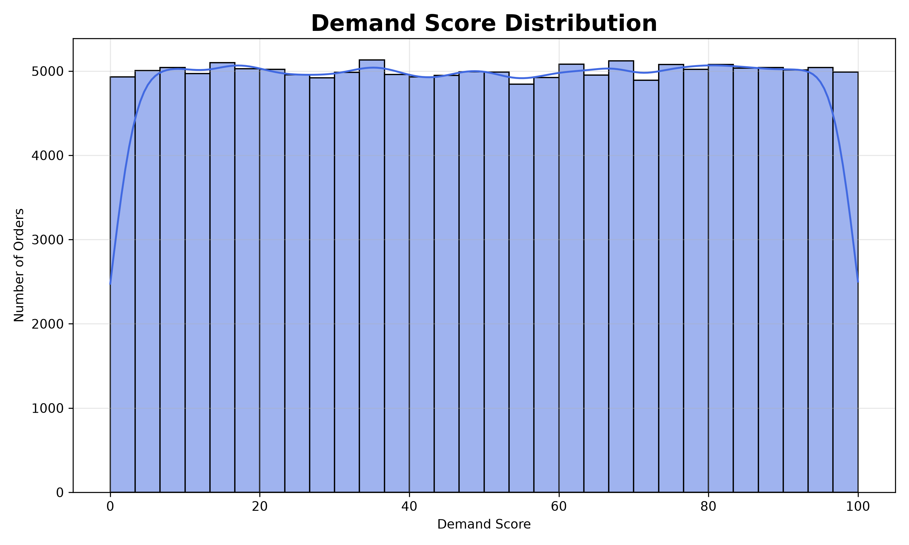

</td>
</tr>
</table>

---

### ⚠️ Risk & Correlation Analysis

<table>
<tr>
<td width="50%">

**Complaint Rate by City**
Complaint rates hover close to the platform-wide **10.07%** average across all five cities, with no single market standing out as a service quality outlier.

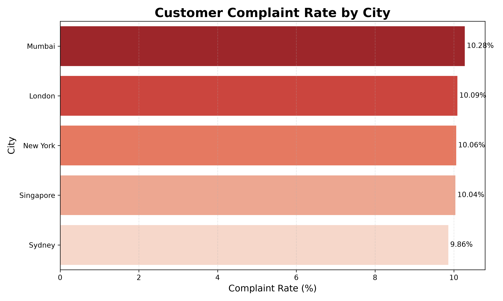

</td>
<td width="50%">

**Churn Risk by Customer Type**
Churn risk scores are broadly similar across New, Returning, and Premium segments — loyalty status alone doesn't strongly predict churn risk in this dataset.

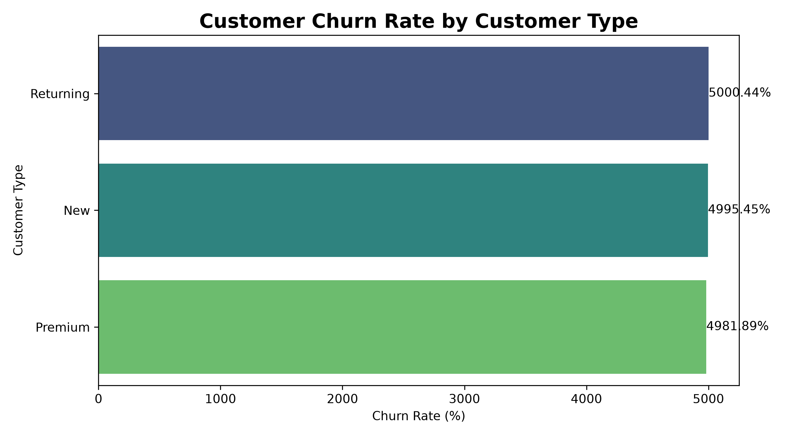

</td>
</tr>
<tr>
<td colspan="2" align="center">

**Correlation Heatmap — All Numeric Features**
Across Customer_Age, Delivery_Distance_KM, Delivery_Time_Min, Order_Value_USD, Item_Count, Revenue_USD, Profit_USD, and Demand_Score, correlations are consistently near **0** — the dataset's numeric fields behave largely independently of one another.

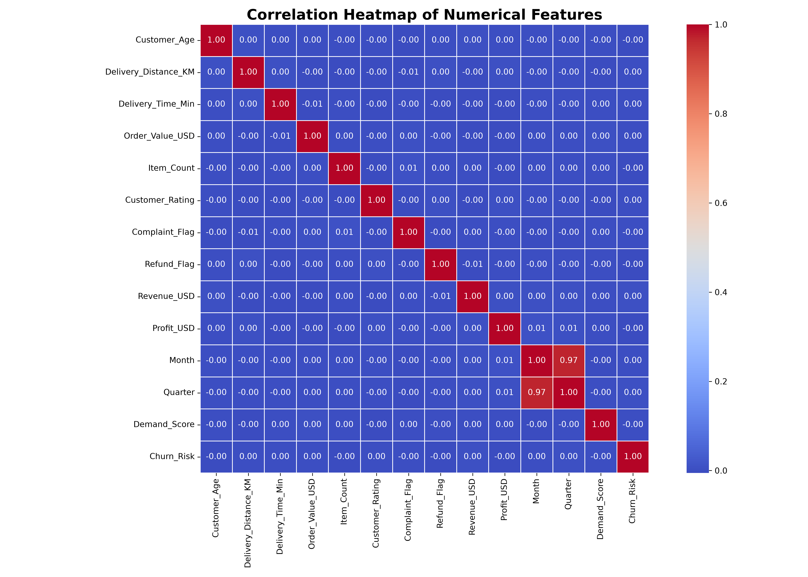

</td>
</tr>
</table>

---

## 💡 Key Insights

- 📍 **Geography is not a differentiator** — revenue is spread almost evenly across all five cities (within a ~2% band), so growth strategy shouldn't lean on any single market.
- 🍔 **Category mix is balanced** — Fast Food, Cafe, Restaurant, and Cloud Kitchen each contribute roughly a quarter of total revenue.
- 🚦 **Traffic and weather have negligible impact on delivery time** in this dataset — average delivery time stays within a ~0.15-minute band regardless of conditions, and distance vs. time correlation is effectively zero. This is worth validating against real operational data, since it runs counter to typical delivery-platform assumptions.
- 💳 **New customers currently out-earn Returning and Premium segments** — a signal that retention and loyalty programs may have room to grow their share of revenue.
- 📉 **Complaint rate (10.07%) is meaningfully higher than refund rate (4.87%)** — over half of complaints don't result in a refund, which could indicate either resolution without refunds or an area for support-process review.
- 🎯 **Demand and churn-risk scores are evenly distributed** rather than concentrated, suggesting these derived scores could be used as-is for targeted operational and marketing rules.

---

## 🚀 Getting Started

```bash
# 1. Clone the repository
git clone <repo-url>
cd QuickCart-Delivery-Analytics

# 2. Create and activate a virtual environment
python -m venv .venv
source .venv/bin/activate        # Windows: .venv\Scripts\activate

# 3. Install dependencies
pip install pandas numpy matplotlib seaborn boto3 sqlalchemy pymysql python-dotenv

# 4. Configure environment variables
#    Create python/e.env with your own AWS + MySQL credentials — never commit real secrets:
#    AWS_ACCESS_KEY_ID=...
#    AWS_SECRET_ACCESS_KEY=...
#    RDS_HOST=...
#    RDS_USER=...
#    RDS_PASSWORD=...
#    RDS_DB=...

# 5. Run the ETL pipeline
python python/etl/pipeline.py

# 6. Generate the analytics & charts
python python/eda.py
```

---

## 📄 License

This project is licensed under the **MIT License** — free to use, modify, and distribute with attribution.

<div align="center">

---

*Built with 🐼 Pandas, 📊 Seaborn, and ☁️ AWS — by the QuickCart Analytics Team*

</div>
